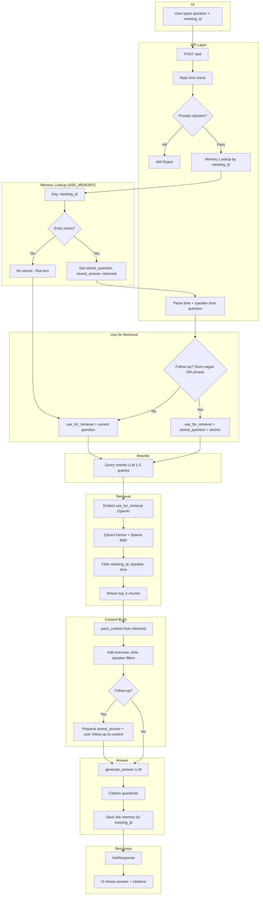

# 🧠 Meeting Intelligence Platform

**Scalable RAG-Based Transcript Understanding System**

A production-oriented Retrieval-Augmented Generation (RAG) system for ingesting meeting transcripts, performing hybrid retrieval (dense + sparse), and generating citation-grounded answers with strict guardrails.

---

## 🚀 Overview

This system enables:

- Transcript ingestion with validation and duplicate detection
- Parsing and chunking with rich metadata
- Hybrid dense + sparse retrieval (RRF fusion)
- Citation-backed answer generation
- Multi-turn conversation support
- Clear roadmap for production scaling

---

## 🏗 System Architecture

### 📥 Ingestion Flow

```
User Upload
  → Validation (size, format)
  → Duplicate Check (content hash)
  → Parsing & Chunking (8 turns per chunk)
  → Metadata Enrichment (time, speakers)
  → Embedding (OpenAI batch)
  → Qdrant Vector Store (upsert)
```

### 🔍 Query Flow

```
User Query
  → Rate Limit & Guardrails
  → Memory Lookup (meeting_id)
  → Time/Speaker Parsing
  → Query Rewriting (1-3 queries)
  → Hybrid Retrieval (Dense + Sparse RRF)
  → Context Builder
  → LLM Answer Generation
  → Citation Guardrails
  → Save Ask Memory
  → Response
```

### 📊 End-to-End Ask Flow



---

## 1️⃣ Synthetic Transcript Generation

**Purpose:** Generate a synthetic meeting transcript based on user-provided topic and participants.

**Used for:**

- Testing ingestion pipeline
- Demo environments
- Simulating real meeting scenarios

**Production alternative:** Real transcripts will be uploaded; preprocessing occurs before ingestion. Synthetic generation can be removed.

---

## 2️⃣ User Input Validation

**Required inputs:**

- `topic` (string, mandatory)
- `participants` (2–10 names, comma-separated)

**Validation rules:**

| Condition       | Result  |
|----------------|---------|
| Empty topic    | HTTP 400 |
| Empty participants | HTTP 400 |
| &lt; 2 participants | HTTP 400 |
| &gt; 10 participants | HTTP 400 |

---

## 3️⃣ Transcript Ingestion

**File requirements:**

- Maximum size: **1 MB**
- Must contain at least one valid line: `[HH:MM:SS] Speaker: text`
- Invalid files → HTTP 400

**Duplicate protection:**

- SHA-256 hash of file content
- Compared against stored ingestion hashes
- If duplicate → return existing `meeting_id` (no re-embedding)
- Benefits: idempotent uploads, avoids cost duplication, prevents vector DB bloat

---

## 4️⃣ Chunking Logic

- **Strategy:** Tumbling window (no overlap), default 8 turns per chunk
- **Per chunk:** `chunk_id`, text, `meeting_id`, `file`, `line_start`/`line_end`, `time_start`/`time_end`, `time_start_sec`/`time_end_sec`, `speakers`
- **Enables:** Time filtering, speaker filtering, citation enforcement, meeting overview summaries

---

## 5️⃣ Embedding Pipeline

- **Batch size:** 32 chunks per API call
- **Model:** `text-embedding-3-small` (1536 dimensions, cosine similarity)
- **Retry:** 3 retries with exponential backoff (0.5s, 1s, 2s)

---

## 6️⃣ Vector Storage (Qdrant)

**Collection:** `meeting_chunks`

**Stored per chunk:**

- Dense vector (cosine similarity)
- Sparse vector (keyword scoring)
- Metadata payload

**Retrieval:**

1. Dense search
2. Sparse search
3. RRF fusion
4. Return top_k (default 10)

**Filters:**

- **Mandatory:** `meeting_id`
- **Optional:** `speaker_filter`, time filter (parsed from question)

---

## 7️⃣ Answer Generation

1. Build context (max 8 chunks)
2. Include metadata filters if applied
3. Send to LLM (`gpt-4o-mini`)
4. Parse structured JSON output
5. Apply citation guardrails
6. Return final response

---

## 🛡️ Citation Guardrails

- Citation must overlap retrieved chunks
- Clamp line ranges to valid ranges
- Drop invalid citations, dedupe
- If no valid citation → return "Not found in transcript."

---

## 8️⃣ Ask Memory (Multi-Turn Support)

**Current:** In-memory storage, lost on restart

**Future:** Redis/database-backed, shared across replicas, audit-ready

---

## 9️⃣ Future Scalability

- Redis job queue
- Worker-based ingestion
- Async embedding
- Cross-encoder reranking
- Dynamic top_k
- Metadata-only citation
- PII redaction, semantic caching
- Langfuse tracing, RAGAS evaluation
- Drift monitoring, CI validation

---

## 🧰 Tech Stack

| Layer       | Technology              |
|------------|--------------------------|
| API        | FastAPI                  |
| Server     | Uvicorn                  |
| LLM        | OpenAI                   |
| Embeddings | text-embedding-3-small   |
| Vector Store | Qdrant                 |
| UI         | Streamlit                |
| Validation | Pydantic                 |
| Config     | python-dotenv            |
| Package Manager | uv                 |
| Python     | 3.12                     |

---

## 📌 Summary

Scalable, production-oriented Meeting Intelligence RAG system with:

- Hybrid retrieval (dense + sparse RRF)
- Strict evidence enforcement
- Multi-turn conversation support
- Clear scaling roadmap
- Enterprise-ready extensibility
