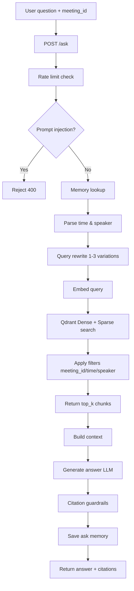
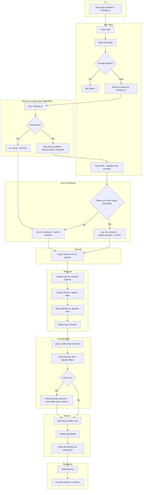

# 🧠 Meeting Intelligence Platform

**Scalable RAG-Based Transcript Understanding System**

---

## What We Built

We built a Meeting Intelligence system that can ingest real meeting transcripts, index them intelligently, and answer questions grounded strictly in transcript evidence.

The goal was simple:

> Given a meeting transcript, allow users to ask natural questions and get precise, citation-backed answers — without hallucinations.

Under the hood, this is a hybrid RAG (Retrieval-Augmented Generation) system with guardrails, structured chunking, and strict evidence enforcement.

---

## 🚀 Why We Built It This Way


- **Idempotent ingestion** — no duplicate vector bloat
- **Time-aware and speaker-aware filtering**
- **Strict citation guardrails** — no fake references
- **Multi-turn follow-up handling**
- **Clear scaling path** toward production

This README explains exactly how the system works.

---

## 🏗 High-Level Architecture

We split the system into two clear flows:

### 📥 Ingestion Flow

```
User Upload
  → Validation (size, format)
  → Duplicate Check (content hash)
  → Parsing & Chunking (8 turns per chunk)
  → Metadata Enrichment (time, speakers)
  → Embedding (OpenAI batch)
  → Qdrant Vector Store (upsert)
```

### 🔍 Ask (Query) Flow

```
User Query
  → Guardrails (rate limit, prompt injection)
  → Memory Lookup (meeting_id)
  → Time/Speaker Parsing
  → Query Rewrite (1–3 variations)
  → Hybrid Retrieval (Dense + Sparse RRF)
  → Context Build
  → LLM Answer
  → Citation Validation
  → Save Memory
  → Response
```

---

## 📊 Full Ask Flow (Detailed)



### 📊 End-to-End Ask Flow (Multi-Turn)



---

## 1️⃣ Synthetic Transcript Generation

Initially, we created synthetic transcripts for testing. Users provide:

- **Topic** (string, mandatory)
- **2–10 participants** (comma-separated)

This allows us to simulate real meetings. However, this step is purely for demo/testing.

**In production:** Real transcripts are uploaded. Synthetic generation can be removed entirely.

**Validation rules:**

| Condition          | Result   |
|--------------------|----------|
| Empty topic        | HTTP 400 |
| Empty participants | HTTP 400 |
| &lt; 2 participants | HTTP 400 |
| &gt; 10 participants | HTTP 400 |

---

## 2️⃣ Ingestion Design Decisions

We deliberately designed ingestion to be strict.

### File Validation

- **Max size:** 1 MB
- **Format:** Must contain at least one valid line: `[HH:MM:SS] Speaker: text`

**Why?** Prevents system abuse, avoids ingesting random text files, keeps embedding cost predictable.

### Duplicate Protection

Before parsing, we compute SHA-256 of file content. If already ingested:

- Return the existing `meeting_id`
- No re-embedding
- No vector duplication

This makes ingestion idempotent and cost-efficient.

---

## 3️⃣ Chunking Strategy

We use a tumbling window approach:

- **8 speaker turns per chunk**
- **No overlap**
- Last chunk may be smaller

Each chunk stores:

- Text, `meeting_id`, `file`
- `line_start` / `line_end`
- `time_start` / `time_end`
- `time_start_sec` / `time_end_sec`
- `speakers`

We enrich metadata because we want time-based filtering, speaker filtering, precise citations, and meeting overview summaries. This metadata becomes extremely important during retrieval.

---

## 4️⃣ Embedding Strategy

- **Batch size:** 32 chunks per API call
- **Model:** `text-embedding-3-small` (1536 dimensions, cosine similarity)
- **Retry:** Exponential backoff (0.5s, 1s, 2s)

**Why?** Real systems fail occasionally — network or rate limits — and ingestion should be resilient.

---

## 5️⃣ Vector Storage (Qdrant)

**Collection:** `meeting_chunks`

Each chunk stores:

- Dense vector
- Sparse vector
- Metadata payload

**Hybrid retrieval:**

1. Dense similarity
2. Sparse keyword scoring
3. RRF (Reciprocal Rank Fusion)
4. Return top_k (default 10)

**Filters:**

- `meeting_id` (mandatory)
- `speaker` (optional, parsed from question)
- Time range (optional, parsed from question)

This guarantees strict meeting isolation.

---

## 6️⃣ Ask Flow — What Actually Happens

When a user asks a question:

1. Rate limit check
2. Prompt injection check
3. Memory lookup by `meeting_id`
4. Parse time references from question
5. Parse speaker references from question
6. Rewrite question into 1–3 search queries
7. Run hybrid retrieval
8. Build context (max 8 chunks)
9. Send to LLM (`gpt-4o-mini`)
10. Validate citations
11. Store ask memory
12. Return answer + citations

---

## 7️⃣ Citation Guardrails (Critical Part)

We do not trust LLM citations blindly. We:

- Define allowed ranges from retrieved chunks
- Ensure citations overlap retrieved content
- Clamp citation ranges to allowed bounds
- Remove invalid citations
- Dedupe duplicates

**If no valid citations remain:** Refuse and return `"Not found in transcript."`

This prevents hallucinated references.

---

## 8️⃣ Multi-Turn Support (Ask Memory)

We store: last question, last answer, retrieved chunks — keyed by `meeting_id`.

| State   | Implementation      |
|---------|---------------------|
| Current | In-memory OrderedDict, lost on restart |
| Future  | Redis-backed, shared across replicas, audit-ready |

---

## 9️⃣ Current Limitations

- Embeddings are synchronous
- Ingestion jobs stored in memory
- No distributed workers yet
- Static top_k
- No reranker yet

These are intentional tradeoffs for iteration speed.

---

## 🔮 Planned Improvements

- Redis job queue
- Worker-based ingestion
- Async embedding
- Cross-encoder reranking
- Dynamic top_k
- Metadata-only citations
- PII redaction layer
- Semantic caching
- Langfuse tracing
- RAGAS evaluation
- Drift monitoring
- CI gating with evaluation datasets

---

## 🧰 Tech Stack

| Layer       | Technology              |
|-------------|-------------------------|
| API         | FastAPI                 |
| Server      | Uvicorn                 |
| LLM         | OpenAI (gpt-4o-mini)    |
| Embeddings  | text-embedding-3-small  |
| Vector DB   | Qdrant                  |
| UI          | Streamlit               |
| Validation  | Pydantic                |
| Config      | python-dotenv           |
| Package Manager | uv                 |
| Python      | 3.12                    |

---

## 🧩 Why This Architecture Works

- **Hybrid retrieval** improves recall
- **Strict filters** improve precision
- **Guardrails** prevent hallucination
- **Metadata** enables time/speaker intelligence
- **Design** supports scaling without redesign

This is not just a demo RAG. It's built with production constraints in mind.
